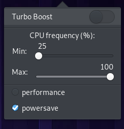

# Wingpanel CPU frequency indicator
wingpanel-indicator-cpufreq is able to adjust the Intel p-state driver (Sandy Bridge and newer)

    

NOTE I recently lost the ability to test turbo boost. if you can give me feedback that the latest changes are working correctly, it will be great

---

  
#### Popover
  

## Building and Installation

### You'll need the following dependencies:
* libgranite-dev
* libpolkit-gobject-1-dev
* libglib2.0-dev
* libgtk-3-dev
* libwingpanel-dev
* policykit-1
* meson
* valac

### How to build
    meson build --prefix=/usr
    ninja -C build
    sudo ninja -C build install
